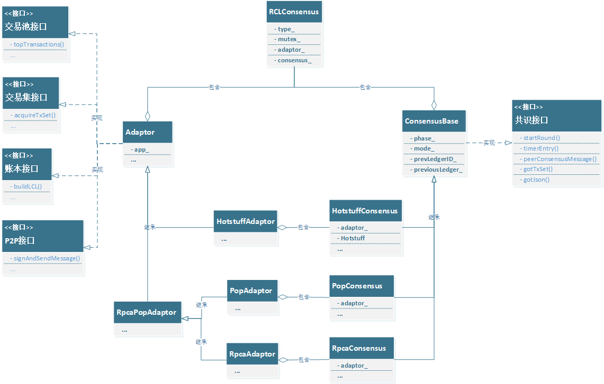

.. _共识可插拔设计:

共识可插拔
############################

1. 总体设计
****************************

ChainSQL3.0已实现可插拔的共识框架，能够兼容接入多种共识算法，目前已接入的共识算法有：\ `RPCA <https://xrpl.org/consensus.html>`_\ 、\ :ref:`POP <PoP共识版本>`\ 、\ `HotStuff <https://arxiv.org/pdf/1803.05069.pdf>`_\ 。

1.1 UML类图
============================

共识模块具有统一的抽象类及接口，如下。

1.2 类描述
============================

1. ``Adaptor`` 是适配器类，提供区块链通用模块的接口。
2. ``RpcaAdaptor`` 、 ``PopAdaptor`` 、 ``HotstuffAdaptor`` 为各不同算法的派生类，继承自 ``Adaptor`` 。
3. ``ConsensusBase`` 为共识逻辑基类，提供公共的对接算法引擎的接口。
4. ``RpcaConsensus`` 、 ``PopConsensus`` 、 ``HotstuffConsensus`` 为各不同算法引擎的派生类，继承自 ``ConsensusBase`` 。并包含各自的 ``Apdator`` 。
5. ``Hotstuff`` 包含于 ``HotstuffConsensus`` 中，是HotStuff流水线算法的核心，同时 ``HotstuffConsensus`` 亦是其接口类。
6. ``RCLConsensus`` 是ChainSQL区块链系统共识模块的入口，并对外部模块提供共识相关的接口。负责根据不同的共识算法创建适配器和共识逻辑引擎，并开启共识。

1.3 接口描述
============================

1.3.1 Adaptor
++++++++++++++++++++++++++++

``Adaptor`` 抽象基类主要实现并提供区块链通用模块的接口：交易池接口、交易集接口、账本接口、P2P接口等，主要接口如下。

**交易池接口：**

1. 从交易池获取交易
2. 更新交易池的状态

**交易集接口**

1. 分享交易集
2. 获取交易集

**账本接口**

1. 执行交易集，产生最新账本
2. 账本是否达成共识
3. 落账账本
4. 账本落后时，同步账本

**P2P接口**

1. 签名并发送共识消息到对等节点

1.3.2 ConsensusBase
++++++++++++++++++++++++++++

``ConsensusBase`` 抽象基类主要包含最基本的共识逻辑接口，如下。

1. 开启共识
2. 定时器处理
3. 算法交互消息处理
4. 获取到交易集后，处理提案
5. 获取当前共识状态

2. P2P消息封装
****************************

ChainSQL3.0以前的版本都只支持一种共识算法，比如1.x.x-pop版本支持POP共识算法。该算法的每个交互消息都在protobuf中独立定义，主要的共识消息有下面几种：

1. 交易集提案消息：TMProposeSet
2. 区块投票消息：TMValidation
3. 变更View提案消息：TMViewChange

但是不同的共识算法会有不同的消息类型，比如HotStuff共识主要有下面的集中消息：

1. 提案：Proposal
2. 投票：Vote

在共识可插拔的设计中共识消息具有统一的消息处理入口，所以所有类型的共识消息需要抽象成一个基础类型。处理接口对不同的消息根据消息类型分发到不同的共识引擎进行处理。具体的消息体则用 ``STObject`` 进行封装和序列化/反序列化处理。

下面是共识消息在protobuf中的格式定义：

.. code::

    message TMConsensus
    {
        required bytes      msg             = 1;    // 消息体
        required uint32     msgType         = 2;    // 消息类型
        required bytes      signerPubKey    = 3;    // 签名公钥
        required bytes      signature       = 4;    // 签名
        optional uint32     signFlags       = 5;    // flag
        optional uint32     hops            = 6;    // 消息路由条数
        required bytes      schemaId        = 7;    // 在多链架构中的链ID
    }

3. POP共识
****************************

POP共识算法是一种确定性出块的共识，包含3阶段两轮异步投票过程，两轮投票分别是交易集投票和区块投票。因为异步的原因，原POP共识算法并没有将对区块投票的轮次处理置于共识逻辑中。

在共识可插拔的设计中，将原POP共识中的区块投票逻辑也统一到了整个共识框架中。

4. 其它
****************************

1. HotStuff共识算法由算法核心类 ``Hotstuff`` 来驱动共识并管理共识轮次。 ``HotsuffConsensus`` 引擎负责启动 ``Hotstuff`` ，不关心核心的共识轮次，作为 ``Hotstuff`` 核心的接口类并管理外部账本的高度变化。
2. 在flag区块所有共识算法都需要通过提交validation来对 ``FeeVote`` 和 ``Amendments`` 进行投票。