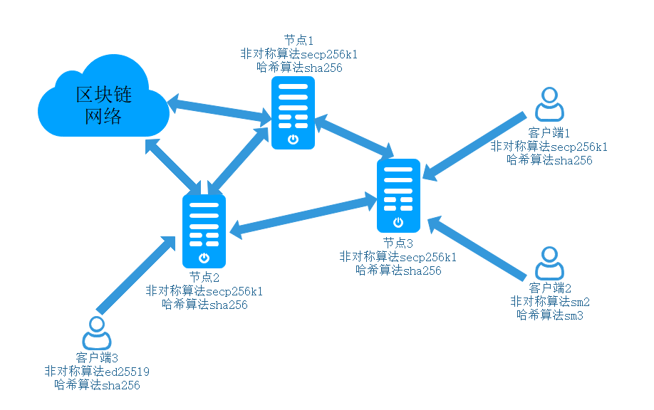

.. _密码算法支持:

密码算法支持
#################

概述
*****************

区块链就是多种密码算法的巧妙组合，再加以共识机制，实现分布式去中心的功能。
ChainSQL区块链目前在非对称密码算法、哈希算法、对称密码算法三类上，每一类都进行算法扩充，实现多算法兼容：

- 非对称密码算法 ：支持secp256k1，ed25519, 国密sm2;
- 哈希算法      ：支持sha系列算法，国密sm3算法；
- 对称密码算法  ：支持AES，国密sm4算法；

不同的算法有不同的性能和使用场景，可以根据自己的需求选择合适的算法。

目前ChainSQL支持多种算法混合兼容运行模式，即用户可以使用任何一种已支持的算法生成对应的密钥对账户，
在同一区块链网络中可以同时存在多种算法生成的账户，且可以相互转账，授权数据库表等操作。

国密算法
*****************
目前ChainSQL对国密算法有两种支持方式：

- 硬件加密，使用硬件设备提供国密算法运算；
- 软件加密，使用北京大学关志副研究员基于openssl开源的GMSSL项目；

两种方式各有优点，硬件更加安全，可以保证私钥保存在硬件设备中，无法导出，但是硬件成本高；
软件使用方便，跟其他算法使用方式无异，成本低。

多种算法混合兼容运行模式
*****************

多种算法混合兼容运行模式示意图：

兼容说明
=================

在同一ChainSQL区块链网络中，可以有不同算法类型的账户兼容存在，如示意图所示，区块链网络中所有节点使用secp256k1及sha算法（同一网络中，所有节点算法必须一致），
然后有三种不同算法类型的客户端，可以在同一个ChainSQL区块链网络中发送交易，且可以相互进行转账操作，并且在ChainSQL区块链中，涉及到表的授权，也是可以相互授权，
不受算法影响。

使用说明
=================

1. 组建区块链网络
多种算法混合兼容运行模式，在组建区块链网络时，需要确定节点使用何种密码算法，在 :ref:`[crypto_alg] <crypto_alg>` 配置项中确定密码算法，
并使用对应的密码算法使用 :ref:`validation_create <validation_create>` 命令生成验证节点需要的validation_seed和validation_public_key。

所有参与统一区块链网络的节点必须使用同一种密码算法。

2. 生成用户账户
可以通过命令行 :ref:`wallet_propose <wallet_propose>` 命令或者使用其他交互接口的生成账户方式，设置不同的算法，生成不同非对称算法的公私钥对及账户。

3. 根据不同交互接口设置算法类型的方式，使用刚才生成的账户，设置需要使用的哈希算法及对称算法，进行交易构建发送。