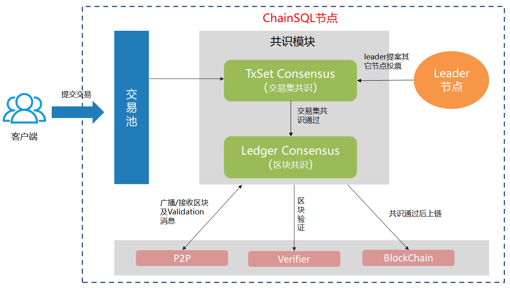

.. _PoP共识版本:

PoP共识算法
#################

概述
*****************

区块链上采用不同的共识算法会对系统的共识效率、去中心会程度产生不同影响。ChainSQL采用的PoP(Proof of Peers)共识算法参考PBFT共识机制对原有共识算法(RPCA)做了优化， 在提高了交易共识效率的同时兼顾了安全性。主要优化有：

1. 通过增加交易池，增加交易的吞吐率；
2. 通过梳理交易验证流程，适当简化接收交易的验证过程来提高交易接收速度；
3. 通过使用leader提案的方式进行交易集共识提高交易集共识效率；
4. 交易执行次数由原来的 2-3次减少到只执行一次。

目前新版本已实现的目标如下：

#. 性能提升（普通8核16G环境，固态硬盘）

  * 发送tps 700 提升到 4000
  * 共识tps 700 提升到 4000
  * 入库tps 500 提升到 1800

#. 出块时间可\ :ref:`配置 <pconsensus配置>`\ ， 最小出块时间为1秒，交易能更快达成共识。
#. 可\ :ref:`配置 <pconsensus配置>`\ 是否生成空区块，默认不生成，解决空区块带来的储存空间浪费问题。
#. ChainSQL原有功能及调用方法基本保持不变。

PoP共识算法介绍
*****************

交互示意图：

总体说明
=================

原始的RPCA共识也是一个两轮2/3的共识过程，与PBFT类似，不同在于，
PBFT是leader提案机制，RPCA是各节点平等，各自提案机制，从这个角度来说，
RPCA相对更加去中心化一点。

RPCA共识流程
-----------------

1. 各节点收集交易。
2. 各节点判断达到了closeLedger条件，开始提案自己的交易集 ``TMProposeSet`` ，由 ``open`` 进入 ``establish`` 阶段。
3. 各节点协商交易集分歧，交换交易交易集达成共识，进入 ``accepted`` 阶段。
4. 各节点根据交易集生成区块，并广播区块 ``TMValidation`` ，同时进入到下一区块的 ``open`` 阶段。
5. 各节点收集到quorum个Validation，区块达成共识。

::

          "close"             "accept"
     open ------- > establish ---------> accepted
       ^               |                    |
       |---------------|                    |
       ^                     "startRound"   |
       |------------------------------------|

PoP共识流程
-----------------

* 目前PoP共识算法修改了RPCA共识的2、3两步，流程如下：

  1. 各节点收集交易
  2. leader点从交易池中不断提取交易
  3. leader节点判断达到了closeLedger条件，开始提案自己的交易集 ``TMProposeSet`` 。
  4. 普通节点收到leader节点广播的交易集后，先向leader节点要交易集的头部信息，然后可以判断自已没有哪些交易，并向leader要自己缺少的交易。
  5. 各节点收集到完整的交易集后，向其它所有节点广播自己的投票，也就是 ``TMProposeSet`` 消息。
  6. 各节点收集其它节点的交易集投票，达到quorum条件，进入到 ``accepted`` 阶段。
  7. 各节点根据交易集生成区块，并广播区块 ``TMValidation`` ，同时进入到下一区块的 ``open`` 阶段。
  8. 各节点收集到quorum个Validation，区块达成共识

  ::

    //leader计算公式:
    leader_idx = (view + block_number) % node_num

* 另一方面，因为是leader提案的机制，必须有对应的容错机制，这里与PBFT一样加入了与交易集共识过程并行的view_change机制：

  1. 初始view为0。
  2. 每个timer判断是交易集共识超时，超时时间默认为3秒，可配置。
  3. 超时未达成交易集共识，则节点广播view_change消息。
  4. 节点收集view_change消息达到quorum，则view++，并改变当前区块leader。
  5. 新的leader重新开始交易集共识。

  .. note::

    如果采用不生成空区块的配置，当leader节点提案空交易集时，各节点收到空交易集提案后，都会触发view_change。

优化点
=================

1. 增加交易池，增加ChainSQL对交易数量上的处理能力。
2. 交易提交时sequence的验证不使用OpenLedger，而是使用自定义类StateManager。
3. 交易集的确认使用leader提案机制，替掉节点各自提案，然后沟通分歧的机制。
4. 线程池中对于任务优先级的调整。
5. 交易只验证一次（之前正常是2-3次）。
6. 出块时间变短。
7. 所有遍历区块中交易的地方，都使用同一个缓存。
8. 同步入库一个区块使用一个事务，之前是一个交易一个事务。
