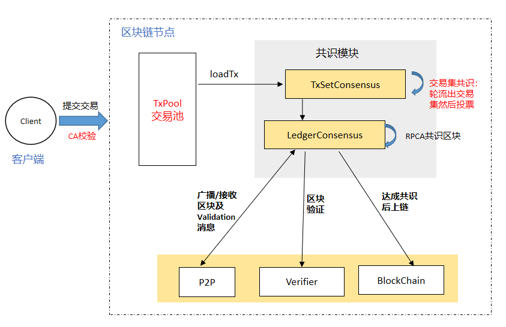
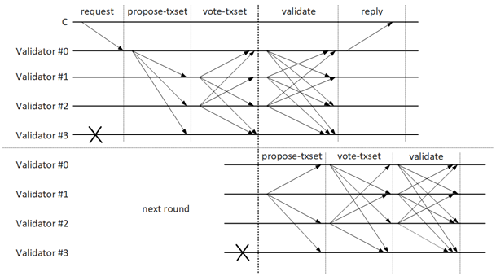

.. _PoP共识版本:

PoP共识算法
#################

概述
*****************

区块链上采用不同的共识算法会对系统的共识效率、去中心化程度产生不同影响。ChainSQL采用的 ``PoP`` (Proof of Peers)共识算法参考PBFT共识机制对原有共识算法( ``RPCA`` )做了优化， 在提高了交易共识效率的同时兼顾了安全性。主要优化有：

1. 通过增加交易池，增加交易的吞吐率；
2. 通过梳理交易验证流程，适当简化接收交易的验证过程来提高交易接收速度；
3. 通过使用 ``leader`` 提案的方式进行交易集共识提高交易集共识效率；
4. 交易执行次数由原来的 2-3次减少到只执行一次。

目前新版本已实现的目标如下：

1. 性能提升（普通8核16G环境，固态硬盘）， ``tps`` 由 700 提升到 4000-7000
2. 出块时间可\ :ref:`配置 <pconsensus配置>`\ ， 最小出块时间为1秒，交易能更快达成共识。
3. 可\ :ref:`配置 <pconsensus配置>`\ 是否生成空区块，默认不生成，解决空区块带来的储存空间浪费问题。
4. ChainSQL原有功能及调用方法基本保持不变。

PoP共识算法介绍
*****************

交互示意图：

总体说明
=================

原始的RPCA共识也是一个两轮2/3的共识过程，与 ``PBFT`` 类似，不同在于，
``PBFT`` 是 ``leader`` 提案机制， ``RPCA`` 是各节点平等，各自提案机制，从这个角度来说，
``RPCA`` 相对更加去中心化一点。

RPCA共识流程
=================

1. 各节点收集交易。
2. 各节点判断达到了出块条件，开始提案自己的交易集 ``TMProposeSet`` ，由 ``open`` 进入 ``establish`` 阶段。
3. 各节点协商交易集分歧，交换各节点缺少的交易使交易集达成共识，进入 ``accepted`` 阶段。
4. 各节点根据交易集生成区块，并广播区块 ``TMValidation`` ，同时进入到下一区块的 ``open`` 阶段。
5. 各节点收集到 ``quorum`` 个 ``Validation`` ，区块达成共识。

::

          "close"             "accept"
     open ------- > establish ---------> accepted
       ^               |                    |
       |---------------|                    |
       ^                     "startRound"   |
       |------------------------------------|

PoP共识流程
=================

* 目前 ``PoP`` 共识算法修改了 ``RPCA`` 共识的2、3两步，流程如下：

  1. 各节点收集交易
  2.  ``leader`` 点从交易池中不断提取交易
  3.  ``leader`` 节点判断达到了 ``closeLedger`` 条件，开始提案自己的交易集 ``TMProposeSet`` 。
  4. 普通节点收到 ``leader`` 节点广播的交易集后，先向 ``leader`` 节点要交易集的头部信息，然后可以判断自已没有哪些交易，并向 ``leader`` 要自己缺少的交易。
  5. 各节点收集到完整的交易集后，向其它所有节点广播自己的投票，也就是 ``TMProposeSet`` 消息。
  6. 各节点收集其它节点的交易集投票，达到 ``quorum`` 条件，进入到 ``accepted`` 阶段。
  7. 各节点根据交易集生成区块，并广播区块 ``TMValidation`` ，同时进入到下一区块的 ``open`` 阶段。
  8. 各节点收集到 ``quorum`` 个 ``Validation`` ，区块达成共识

.. code-block:: javascript

    // ``leader`` 计算公式:
    ``leader`` _idx = (view + block_number) % node_num

* 另一方面，因为是 ``leader`` 提案的机制，必须有对应的容错机制，这里与 ``PBFT`` 一样加入了与交易集共识过程并行的 ``view_change`` 机制：

  1. 初始view为0。
  2. 每个timer判断交易集共识是否超时，超时时间默认为3秒，可配置。
  3. 超时未达成交易集共识，则节点广播 ``view_change`` 消息。
  4. 节点收集 ``view_change`` 消息达到 ``quorum`` ，则 ``view++``，并改变当前区块 ``leader`` 。
  5. 新的 ``leader`` 重新开始交易集共识。

  .. note::

    如果采用不生成空区块的配置，当 ``leader`` 节点提案空交易集时，各节点收到空交易集提案后，都会触发 ``view_change``。

保活机制
=================

BFT类共识算法，都会面临活性问题， ``POP`` 共识的保活机制如下

1. 出现共识超时，用 ``view_change`` 机制实现换主，切换主节点重新提案，与 ``PBFT`` 一致，解决主节点宕机或出现拜占庭错误的情况
2. ``view_change`` 无法达成共识，比如四个节点，两个的view要变到N，另外两个要变到N+1但是所有节点都基于同一区块共识，这种情况下， ``POP`` 共识用5次超时回滚机制，即:
  
    | 出现5次 ``view_change`` 超时的的情况下，回滚view到0，重新共识，因为基于的区块是一致的，所以最终能达成共识

3. 四个节点，两个基于区块N共识，另外两个基于区块N+1共识，这种情况下，通过 ``view_change`` 是无法达成共识的， ``POP`` 共识用重新拉取投票的方式达成一致：

    | a. 每个节点广播的 ``view_change`` 消息中，添加字段 ``validatedSeq`` 表示当前共识基于的最新共识过的区块号
    | b. 当出现上述问题时，每个节点根据自己收集到的 ``view_change`` 消息，比较其中的 ``validatedSeq`` 值，如果有 ``validatedSeq`` 值比自己大的，那么向这一节点请求 ``validatedSeq`` 区块共识的投票
    | c. 收到投票后，进行验证两点：一是投票是否都由自己信任的节点发出（通过签名验证），二是验证投票数量是否达到共识阈值，如果两点都满足，那么请求这一最新区块，并切换到这一区块继续共识

与其它共识算法对比
************************

对比PBFT共识
================

  ``POP`` 共识算法是参考了 ``PBFT`` 共识算法完成的，相对于 ``PBFT`` 共识算法而言，主要的优化在于以下两点：
  
  1. 交易集广播优化， ``leader`` 提案的交易集是一个交易集合组成的树的根 ``hash`` ，其它节点通过这个根 ``hash`` 去请求整个交易树，事实证明这样大大 **减小了广播包的大小** ，又能以很快的速度让各节点收集完整的交易集
  2. **流水线共识** ， ``POP`` 共识的两轮共识是 **并行** 的，也就是：前一区块N的第二轮共识与后一区块N+1的第一轮共识是同时进行的，具体过程见下图：
  

对比RPCA共识
================

  ``POP`` 共识相对 ``RPCA`` 共识都属于流水线共识，优化点主要体现在以下两方面：

  1. 由 ``RPCA`` 共识的节点各自提案交易集改为 ``leader`` 节点提案，其它节点收集，这样大大减少了 ``RPCA`` 共识解决分歧的时间
  2. 交易的验证，从两次完整校验，改为一次简单校验加一次完整校验，交易的接收速度增加显著

