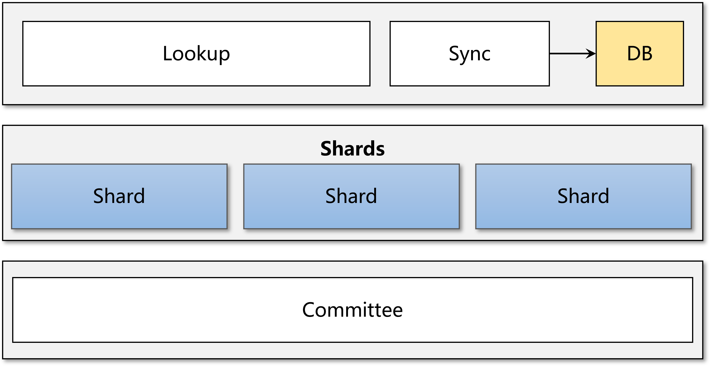
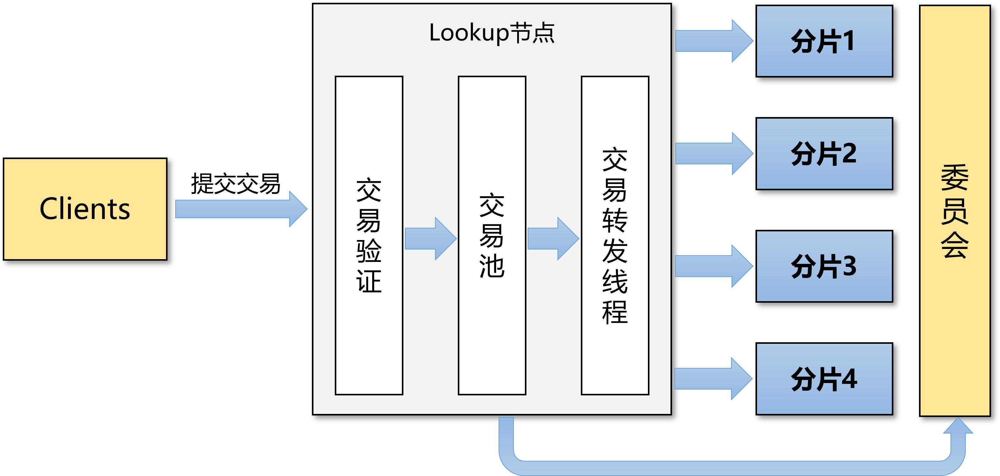

分片设计
############################

1. 总体设计
****************************

为了应对规模稍大一些的联盟链应用场景，以及提高区块链系统的整体交易吞吐量和共识TPS，ChainSQL2.0分片应运而生。

1.1 架构图
============================

1.2 时序图
============================

1.3 数据流向图
============================

.. _分片设计节点角色:

2. 节点角色划分
****************************

2.1 Lookup节点
============================

1. 与客户端对接，接收客户端交易、发布区块。
2. 对交易进行初步验证、分片、打包、签名发送到对应分片或委员会。
3. 收集 ``FinalLedger`` 和 ``MicroLedger`` ，形成区块，持久化所有区块及交易详情与回执。

2.2 分片节点
============================

1. 应用处理从Lookup节点收到的交易。
2. 对分片内交易集进行共识，生产 ``MicroLedger`` 。
3. 分发 ``MicroLedger`` 到委员会节点。
4. 分发 ``MicroLedger`` 包含交易的Meta Data到Lookup节点和Sync节点。
5. 收集 ``FinalLedger`` ，形成区块（区块中不包括交易实体），持久化区块。

2.3 委员会节点
============================

1. 收集各个分片产生的 ``MicroLedger`` 。
2. 对分片 ``MicroLedger`` 以及本分片交易集进行共识，生产 ``FinalLedger`` 。
3. 分发 ``FinalLedger`` 到各分片节点、Lookup节点和Sync节点。
4. 所有委员会节点组成委员会分片（一个特殊的分片），同时具有分片节点的行为。

2.4 (DB)Sync节点
============================

1. 收集 ``FinalLedger`` 和 ``MicorLedger`` ，形成区块，持久化所有区块及交易详情与回执。
2. 连接后端结构化数据库，根据配置进行数据库表同步。
3. 与客户端对接，提供数据库表查询相关服务。

.. note::

    Sync节点在分片网络中不是必须的成员节点，将表同步功能置于插件式节点当中的设计规划，便于以后扩展其它功能性节点。

3. 网络分片
****************************

ChainSQL主要定位为联盟链，在设计思路上主要考虑联盟链的应用场景及规模。联盟链的节点数一般不会太多，所以节点的网络分片可直接人为进行规划，然后在节点配置文件中进行配置。

1. 每个节点都必须配置自身的角色及规划的总分片数，如果是分片节点，还需指定所属分片的分片号。
2. Lookup节点和Sync节点必须配置所有分片节点和委员会节点。并且所有Lookup节点和Sync节点之间应尽量保持连通性和信任关系，便于互相之间进行区块同步。
3. 分片节点需要配置所属分片的其它分片节点、所有委员会节点和所有Lookup节点。
4. 委员会节点需要配置所有分片节点、其它委员会节点和所有Lookup节点。

配置说明详见分片使用手册\ :ref:`分片节点配置 <分片手册节点配置>`\ 章节。

如果整个网络的规模过大，在每个节点上都进行配置的过程过于繁琐且容易出错，可利用UNL Server进行网络中验证节点公钥的配置及管理（参看\ :ref:`动态增删节点 <分片设计动态增删节点>`\ 章节），但不同角色节点之间的P2P连接仍需在每个节点配置文件中进行配置。

.. _分片设计交易分片:

4. 交易分片
****************************

Lookup节点可并行接收客户端发出的交易，并对交易进行分片，将交易划分到不同的片区。对交易进行分片是以交易发起者的账户地址为依据进行分片。具体方法为：交易发起者账户地址Base58编码的后4个字节与分片总数的余数再加1，即为交易对应的片区号。交易所属分片号n的计算公式如下。

.. code-block:: console

    n = ((toBase58(fromAddr) & 0xFFFFFFFF) % N) + 1

例如当规划的总分片数为3时，交易发起者账户Base58编码后4个字节与交易所属片区的关系如下：

============  =============
后4个字节      所属分片号
============  =============
0x00000000      1 
0x00000001      2
0x00000002      3
0x00000003      1
...             ...
============  =============

.. note::

    目前这种交易分片的方法只适用于非调用合约的交易类型。合约调用类型的交易有可能被划分到委员会片区。

关于调用合约的交易分片详见\ :ref:`智能合约章节 <分片设计智能合约>`\ 。

5. P2P
****************************

各节点之间通过SSL建立长连接，并通过ping-pong心跳包来探测延迟和维持连接。

5.1 Hello
============================

在初始点到点连接建立后，节点之间再通过HTTPS发送HTTP Hello Request和Hello Response握手消息，Hello消息包含节点的版本号、P2P协议版本、P2P公钥、当前账本等信息。

分片版本中Hello Request和Hello Response包含本节点的\ :ref:`节点角色 <分片设计节点角色>`\ 以及所在分片号，Lookup节点和Sync节点的分片号为 ``0xffffffff`` ，委员会节点的分片号为 ``0`` 。

在目前的公开版本中，没有对Hello中通告的节点角色和分片号进行强验证，允许节点以观察者的身份以及想要充当的角色加入到网络中。后续，计划在以后的版本中加入验证功能，Hello消息中将包含节点Validator Key对分片角色和分片号的签名，对等节点验证签名以及公钥是否在本节点的信任公钥列表中。验证通过后才与节点建立P2P关系，也可作为节点准入的一道门槛。对于Sync节点则需要配置[validator_seed]；所有节点都增加新的配置项[sync_public_keys]，配置可新的Sync节点公钥列表。

5.2 网络拓扑
============================

分片网络中各验证节点之间应尽量保证相互之间的连通性，但不同分片节点之间不需要也不会建立P2P连接，也就是各个分片网络是相互隔离开来的。

5.3 分组分发
============================

随着分片网络规模的增大，不同节点角色之间消息分发，比如委员会分片向所有分片节点、Lookup节点以及Sync节点分发 ``FinalLedger`` ，消耗的网络带宽将不断增大，性能也会因此受损。分片设计以大规模部署节点以及提高TPS为出发点，采用消息分组分发的方式来降低消息广播方式的网络复杂度。

分组分发在确保所有发送方节点分组后，每个分组中至少存在一个参与了此轮共识的正常节点的前提下，将发送方节点分成n组，再将接收方所有节点分成n组。每个分组内的发送方节点将消息广播给对应的接收方分组节点。相比于所有节点全广播的方式，分组分发的方式在确保网络通信具备一定的冗余的同时，能够减少网络消息数量，降低网络拥塞的风险。

6. 交易处理流程
****************************

交易由Lookup节点从客户端接收及转发到各分片，Lookup节点对交易处理的主要工作流如下：

1. 从客户端收到交易后进行验证，验证交易签名、费用及Sequence。交易的Sequence只需大于或等于 ``StateManager`` 模块中维护的Sequence。
2. 交易验证通过后返回交易提交结果给客户端，并将交易有序存放到交易池中。
3. 交易转发线程从交易池中批量获取交易，对交易进行分片，打包并签名发送到对应分片或委员会分片。

 
Lookup节点通过 ``StateManger`` 模块各自维护账本中账户的Sequence，Lookup节点之间不互相传播交易，在一个账本落账之前， ``StateManager`` 无法达成一致。为了保证在此期间系统的可用性，客户端及各节点对交易相关的处理方式如下。

6.1 客户端
============================

* 客户端维护链上账户的Sequence，目前\ :ref:`Java SDK <分片手册JavaSDK>`\ 已有针对分片的版本。
* 客户端或SDK使用某个账户与Lookup节点建立连接时，从Lookup节点查询一次Sequence，并进行维护。
* 提交交易给Lookup节点后，从Lookup节点返回 ``tefPAST_SEQ`` 错误(Sequence太小)或超时错误时，从Lookup节点查询一次Sequence，并更新。再次提交交易，直至交易入块成功，或达到指定提交次数。

6.2 Lookup节点
============================

* Lookup节点维护 ``StateManager`` 模块。
* 在处理 ``account_info`` 请求时，对于账户的Sequence字段，返回 ``StateManger`` 和最新 ``OpenLedger`` 中较大的值。
* 验证交易时，如果Sequence大于 ``StateManager`` 中的Sequence，则从最新 ``OpenLedger`` 中查询一次，并更新 ``StateManager`` 为较大值。确保当前 ``StateManager`` 的正确性。
* 验证交易时，交易Sequence大于 ``StateManager`` 中Sequence的交易，也进入交易池中，并返回客户端交易的提交结果为 ``tesSUCCESS`` 。后续将交易进行分片、打包并对交易包进行签名发送给交易包所属分片节点。
* 针对Sign-and-Submit模式，提交的tx_json中必须提供Sequence字段，不再为此模式自动添加Sequence。
* ``StateManager`` 增加老化机制，老化后重新从最新的 ``OpenLedger`` 中同步。

6.3 分片节点
============================

* 分片节点（委员会节点也属于一个特殊的分片）维护 ``StateManager`` 模块。
* 同一个账户的交易（智能合约调用交易）可能被划分到委员会分片，账户Sequence可能在委员会分片中更新。
* 从Lookup节点接收到打包后的交易后，对交易包进行签名验证，确保交易包来源于所信任的Lookup节点。
* 验证交易时，如果Sequence大于 ``StateManager`` 模块中的Sequence，则从最新的 ``OpenLedger`` 中查询一次，并更新 ``StateManager`` 为较大值，确保当前 ``StateManager`` 的正确性。交易Sequence必须于 ``StateManager`` 维护的账户Sequence一致才能进入交易池。
* 每次落块后，查看交易挂起队列中是否有交易，根据挂起队列中交易的源地址，从最新落账账本更新一次该账户的Sequence，确保当前 ``StateManager`` 的正确性，并应用一遍挂起的交易队列。

7. 共识机制
****************************

目前各分片内部共识算法只支持POP共识算法，并对POP共识算法进行了必要的修改。关键修改点是将POP的异步两阶段修改为同步两阶段。

7.1 分片共识
============================

* 每个分片内部同时进行分片内共识，并生成各自分片的微区块 ``MicroLedger`` 。
* 每轮共识，依旧由各自分片内该轮次的Leader节点进行交易集提案，再进入 ``Accept`` 阶段之后不进入下一轮的 ``Open`` 阶段，而是继续对微区块进行 ``Validation`` 的投票。
* 微区块的 ``Validation`` 达成共识之后，将微区块以及满足阈值的 ``Validation`` 中对微区块的签名集合分组分发到委员会节点。微区块中不包含原始交易详情和交易的Meta Data，只包含交易产生的状态修改集 ``StateDelta`` 。
* 然后进入 ``waitingFinalLedger`` 阶段，等待委员会节点提交 ``FinalLedger`` ，在收到委员会节点的 ``FinalLedger`` 之后对其进行验证，并进行\ :ref:`持久化 <分片设计持久化>`\ 落块。
* 将本分片已共识的微区块发送给Lookup节点和Sync节点，微区块中包含原始交易详情和交易的Meta Data。
* 切换Leader节点，进入 ``Open`` 阶段，开启下一轮共识。

7.2 委员会共识
============================

* 委员会每轮共识中对两个集合进行共识，一个是委员会自身分片的交易集，一个所有分片提交的微区块集合。
* 从 ``Open`` 阶段进入 ``Establish`` 阶段的条件为收集到所有分片的有效微区块。
* Leader节点同时提案交易集和微区块集。
* 进入 ``Accept`` 阶段后，依次应用所有微区块中的 ``StateDelta`` ，再应用自身分片的交易集，生成 ``FinalLedger`` ，并对 ``FinalLedger`` 进行 ``Validation`` 投票。
* ``FinalLedger`` 的 ``Validation`` 达成共识之后，将 ``FinalLedger`` 以及满足阈值的 ``Validation`` 中对 ``FinalLedger`` 的签名集合分组分发到其它所有节点。 ``FinalLedger`` 中不包含原始交易详情和交易的Meta Data，只包含最终账本状态。
* 切换Leader节点，进入 ``Open`` 阶段，开启下一轮共识。

7.3 空区块及ViewChange
============================

:ref:`POP共识 <POP共识算法版本>`\ 参数 ``omit_empty_block`` （不生成空区块）配置不再生效，使用以下固定的处理方式。

* 分片节点共识空区块，生产并提交空的微区块到委员会节点。
* 委员会节点不生成和提交空区块，如果本轮收集的所有微区块都为空区块，并且滋生提案的交易集为空交易集，那么将再此轮进行ViewChange。ViewChange之后进行Leader切换，并进入下一轮共识。
* 分片无法达成共识时，每个分片内部进行独立的ViewChange，并进行Leader切换。
* 委员会ViewChange达成之后，将ViewChange提交给所有分片节点和Lookup节点，用于状态更新和区块同步。

.. note::

    整体共识过程中，最终是不会有空区块产生的。

.. _分片设计智能合约:

8. 智能合约
****************************

智能合约在ChainSQL的账户模型中有自己的账户地址，同时具备普通账户的属性和合约自身的内部存储。智能合约的内部存储用KV来记录，不同的智能合约，其内部存储的差异巨大。KV值要建立差异关系，非常的复杂，不利于 ``StateDelta`` 的计算和合并处理。ChainSQL智能合约交易类型分为创建智能合约和调用智能合约，目前的分片模型不利于对调用同一个智能合约的交易进行分片并行处理。所以调用同一个智能合约的交易在一个整体共识轮次中应同时只在一个分片中处理，需要避免并行处理。

:ref:`交易分片 <分片设计交易分片>`\ 后，根据该交易影响的所有账户的地址是否都属于同一个分片，可以将交易从逻辑上分为片内交易和片间交易。片内交易，即该交易影响的所有账户的地址都属于同一个分片；片间交易，即该交易影响的所有账户的地址至少属于2个分片。

8.1 智能合约交易分片
============================

1. 创建智能合约的交易与其它普通交易的分片方案一致。
2. 调用智能合约的交易属于片内交易时，交易划分到交易发起者所在分片，也即智能合约账户所在分片。
3. 调用智能合约的交易属于片间交易时，交易划分到委员会分片。

8.2 委员会智能合约交易处理
============================

1. 委员会对 ``FinalLedger`` 的共识在所有分片都提交了微区块之后开启。开启之后，先应用所有微区块，在合并后的账本状态基础上再应用委员会分片上的智能合约交易。
2. 同时委员会作为一个特殊分片，也共识并提交微区块、交易实体、交易Meta Data到Lookup节点和Sync节点。

8.3合约嵌套调用
============================

1. 被分发到普通分片中的合约交易，可能出现调用另一个合约的情况，即合约的嵌套调用。
2. 如果被调合约与源合约在一个分片中，分片能够正确处理。
3. 如果被调合约与源合约不在一个分片中，将引起同一个合约的交易在不同分片中同时被处理，这时候合约状态将出现不确定性。
4. 为避免上述的不确定性发生，分片在处理这种交易时，返回错误码 ``tefCONTRACT_DIFF_SHARD`` ，并进行回滚处理。
5. 合约交易体中可增加布尔类型字段 ``Priority`` （参考分片使用手册\ :ref:`客户端 <分片手册客户端>`\ 章节），Lookup节点将此交易划分到委员会分片。

.. _分片设计持久化:

9. 持久化
****************************

1. 分片节点和委员会节点不存储原始交易详情与交易Meta Data。索引数据库SQLite和KV数据库（NuDB或RocksDB）均不存储。
2. Lookup节点和Sync节点存储原始交易详细与Meta Data。只在KV数据库（NuDB或RocksDB）中存储，索引数据库SQLite中不再存储 ``TxRaw`` 与 ``TxMeta`` ，只存储交易索引相关数据。
3. 客户端通过Lookup节点查询历史交易时，Lookup节点先从索引数据库SQLite中查询到交易的索引信息，再通过历史账本获取到原始交易详情以及交易的Meta Data，返回给客户端。

.. _分片设计动态增删节点:

10. 动态增删节点
****************************

ChainSQL分片节点可通过本地配置文件配置整个分片网络中各种角色的信任验证节点公钥列表，同时也可通过远端站点配置各种角色验证节点公钥列表。本地配置文件中配置的验证节点无法热修改，需修改配置后重启；远程站点上配置的信任节点可热修改，无需重启节点。

两种方式可配合使用，本地配置文件上配置的验证节点和远程站点上配置的验证节点可重复，修改远程站点上的配置不会影响本地已经配置的验证节点配置。

| 关于ChainSQL分片的节点配置可参考分片使用手册\ :ref:`节点配置 <分片手册节点配置>`\ 章节。
| 关于远端站点的配置及使用可参考分片使用手册\ :ref:`UNL Server <分片手册UNLServer>`\ 章节。

目前，有两种方式来对已有的分片网络规模进行扩展或裁剪。

**第一种方式为变更节点配置文件。**

通过变更节点配置文件中验证节点公钥列表相关的配置项来达成整个网络中验证节点加入和退出的要求。首先，对分片网络中已有节点的配置文件进行统一的修改，然后在保证整个网络可用性的同时，依次重启网络中的所有节点。最后启动新节点或停止被移除的节点。

由于分片网络中，一般节点数都比较多，这种处理方式相当比较繁琐。

**第二种方式为使用UNL Server。**

这种方式需要分片网络中所有节点都事先配置好了UNL Server。采用这种方式就不需要再修改节点的配置文件并重启节点了。只需要增、删或修改UNL Server中的信任节点公钥列表及节点角色。节点从UNL Server同步到网络规模的变更后，分片网络规模的扩展和裁剪就完成了。

11.  分片性能
****************************

ChainSQL分片在对节点进行网络分片的基础上再对交易进行分片并行共识，极大的提高了区块链网络的性能。

11.1 性能提升关键点
============================

1. 分片网络可通过多个Lookup节点接收交易，增加交易吞吐量。
2. 各分片节点都只接收本分片的交易，不需要同步所有交易，减少了交易同步时间。
3. 各分片节点只验证/执行本分片内的交易，且只执行一次，减少了交易执行时间。
4. 分片内交易执行结果是状态的变更，各分片对状态变更 ``StateDelta`` 进行共识并提交。
5. 委员会节点不需执行普通分片内的交易，只汇总交易哈希集合与 ``StateDelta`` ，然后进行区块共识。共识达成之后，下发到所有节点，落块时不需再应用交易，快速改变链的状态。

11.2 分片性能总结
============================

1. 通过测试执⾏不同分⽚数网络规模的交易共识⽤例，得出交易共识TPS随着分⽚总数的增加而增加。
2. 当客户端交易发送TPS⾜够时，交易共识TPS至少可达30000/s。
3. 通过测试单笔数据库插入交易和多笔数据库插入交易发现，分⽚数的增加不会对交数据库⼊库性能造成影响。单笔交易的生命周期（从发送到⼊库完成）平均在1-2s左右。