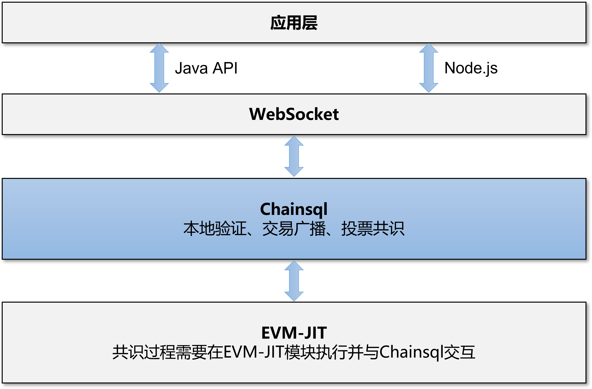

智能合约
#####################################

引言
*************************************

编写目的
+++++++++++++++++++++++++++++++++++++

设计Chainsql中智能合约的实现方案，通过此文档可对Chainsql中的智能合约有深入的了解。

背景
+++++++++++++++++++++++++++++++++++++

基于以下技术实现：

 * ChainSQL 的区块链技术实现
 * 以太坊客户端\ `C++实现 <https://github.com/ethereum/aleth>`_
 * 以太坊虚拟机EVM
 * llvm框架

总体说明
*************************************

阶段目标
+++++++++++++++++++++++++++++++++++++

 1. 一期实现对以太坊智能合约的支持，兼容用solidity语言编写的智能合约。
 2. 二期：

    i.  实现在智能合约中支持Chainsql对表的操作；
    ii. 支持在智能合约中操作通过网关发行的代币，支持在智能合约中发行网关代币及相关操作。

修改方案
+++++++++++++++++++++++++++++++++++++

一期修改：

 * 底层：在ChainSQL最新源码基础上添加对以太坊智能合约的支持，集成evm中JIT的实现模块，llvm编译模块，并添加新的交易类型与虚拟机进行交互，最终实现可通过交易完成合约的发布、调用。
 * 上层：上层提供Node.js与Java版本的api，在原chainsql api的基础上增加对智能合约的支持。

二期修改：

* 修改solidity工程，添加对表相关操作指令的扩展指令、发行代币相关功能指令
* 修改ChainSQL节点工程，支持扩展指令

系统架构
+++++++++++++++++++++++++++++++++++++

基本功能
*************************************

合约部署
+++++++++++++++++++++++++++++++++++++

 * 支持通过chainsql节点部署智能合约，通过api进行操作的步骤如下：

    i.   用户编写solidity合约。
    ii.  编译solidity代码，得到可执行字节码。
    iii. 调用chainsql提交部署智能合约交易，并订阅交易状态。
    iv.  交易共识通过触发回调，合约部署成功。
    v.   通过查询合约交易信息，获得合约地址。

合约调用
+++++++++++++++++++++++++++++++++++++

 * 合约部署成功后，api层可调用合约对象中的方法(与solidity中的定义一致)来调用合约，合约的调用方式分为两种：

    i.  set方法，改变合约状态，这种方法需要以发送交易的方式进行调用。
    ii. get方法，不改变合约状态，这种方法可直接调用chainsql提供的接口来获取返回结果。

给合约地址转账
+++++++++++++++++++++++++++++++++++++

 * 与其它账户地址不同，合约地址在Chainsql网络中是可以是没有ZXC余额的。
 * 不能通过Payment类型的交易给合约地址转账。
 * Api层提供了\ ``payToContract``\ 接口对合约地址进行转账。
 * 合约中必须提供\ ``payable``\ 修饰的\ ``fallback``\ 函数，不然合约地址无法接受转账。

Gas
+++++++++++++++++++++++++++++++++++++

 * Chainsql中的智能合约执行也是消耗\ ``Gas``\ 的，\ ``Gas``\ 计算规则与以太坊中的一致。
 * Chainsql中用户不可以设置\ ``GasPrice``\ ，只可以设置\ ``GasLimit``\ ，交易出现排队时，根据交易中\ ``Fee``\ 字段的值排列优先级。
 * Chainsql中的\ ``GasPrice``\ 由系统决定，并且会随当前网络负载而变化。
 * GasPrice初始值为10drop(1e-5 ZXC)，最大值为20drop。

支持表操作
+++++++++++++++++++++++++++++++++++++

 * 支持在智能合约中进行表的各种操作。

支持网关发行代币、代币流通。
+++++++++++++++++++++++++++++++++++++

 * 支持智能合约中进行网关设置、信任网关、代币的转账等。

性能指标
*************************************

``TODO``

实现
*************************************

LedgerNode修改：AccountRoot
+++++++++++++++++++++++++++++++++++++

 * 合约地址生成使用原有地址计算规则，以部署合约帐户与帐户当前交易序号为原像，合约只有地址，无公私钥。
 * 合约在Chainsql中也是以\ ``AccountRoot``\ 这种\ ``LedgerNode``\ 的形式存在。
 * \ ``AccountRoot``\ 增加了下面的可选字段：

.. list-table::

    * - **字段名**
      - **类型**
      - **说明**
    * - StorageOverlay
      - STMap256
      - 合约中的存储
    * - ContractCode
      - STBlob
      - 合约中的字节码，调用合约时使用

增加交易类型Contract
+++++++++++++++++++++++++++++++++++++

 * Chainsql中智能合约的部署、修改状态的方法调用，都要通过Contract类型的交易进行。
 * 交易中的字段说明（略过常规字段如\ ``Account``\ 、\ ``Sequence``\ 等）：

.. list-table::

    * - **字段名**
      - **类型**
      - **是否必填**
      - **说明**
    * - ContractOpType
      - UINT16
      - 必填
      - 操作类型，1为合约部署，2为合约调用
    * - ContractData
      - STBlob
      - 必填
      - 部署合约/调用合约时的输入值
    * - Gas
      - UINT32
      - 必填
      - 部署/调用合约交易时，需设置的Gas上限
    * - ContractAddress
      - STACCOUNT
      - 选填
      - 合约地址，调用合约时填写
    * - ContractValue
      - STAMOUNT
      - 选填
      - 本次交易要给合约地址转账的金额

增加接口contract_call
+++++++++++++++++++++++++++++++++++++

 * Chainsql中不修改合约状态的方法调用，需要通过\ ``contract_call``\ 接口来实现。
 * 接口中的字段说明：

.. list-table::
    :align: left

    * - **字段名**
      - **类型**
      - **说明**
    * - account
      - 字符串
      - 调用合约的地址
    * - contract_address
      - 字符串
      - 合约地址
    * - contract_data
      - 字符串
      - 合约数据

自定义数据类型STMap256
+++++++++++++++++++++++++++++++++++++

 * key与value均为uint256类型的map，用于存储合约中的状态。

RPC接口
*************************************

 * :ref:`合约部署交易 <rpc部署合约>`
 * :ref:`合约的调用（Set） <rpc调用合约>`
 * :ref:`合约的调用（Get）<rpc查询合约>`

Websocket接口
*************************************

 * :ref:`合约部署交易 <websocket部署合约>`
 * :ref:`合约的调用（Set） <websocket调用合约>`
 * :ref:`合约的调用（Get）<websocket查询合约>`

.. _Table_sol_instruction:

对表的支持
*************************************

.. note::
    | ``owner`` 为address类型，表的拥有者地址。
    | ``raw`` 为字符串类型，非16进制，JSON格式。

创建表
+++++++++++++++++++++++++++++++++++++

.. code-block:: javascript

    owner.create("table_name", "create raw string");

    // example
    function createTable(string name, string raw) public {
        msg.sender.create(name, raw);
    }

插入
+++++++++++++++++++++++++++++++++++++

.. code-block:: javascript

    owner.insert("table_name", "insert raw string");

    // example
    function insertToTable(address owner, string name, string raw) public {
        owner.insert(name, raw);
    }

删除行
+++++++++++++++++++++++++++++++++++++

.. code-block:: javascript

    // delete参数代表删除条件
    owner.delete("table_name", "raw string");

    // example
    function deleteFromTable(address owner, string name, string raw) public {
        owner.delete(name, raw);
    }

修改
+++++++++++++++++++++++++++++++++++++

.. code-block:: javascript

    // update需要两个参数
    owner.update(table_name, "raw string", "get raw");

    // example
    function updateTable(address owner, string name, string getRaw, string updateRaw) public {
        owner.update(name, updateRaw, getRaw);
    }

查询
+++++++++++++++++++++++++++++++++++++

 * 查询返回一个句柄，需要自定义一个类型，如handle（或者直接使用uint256）。
 * handle不可作为函数返回值返回（只能作为临时对象使用），也不能作为成员变量使用（作为成员变量使用，跨交易时，会获取不到内容）。
 * 可根据查询得到的句柄去获取查询结果中的字段值。
 * 提供遍历方法，可根据句柄遍历查询结果。

.. code-block:: javascript

    uint256 handle = owner.get(tableName, raw);
    uint row = db.getRowSize(handle);
    uint col = db.getColSize(handle);
    string memory xxx;
    for (uint i = 0; i < row; i++)
    {
        for (uint j = 0; j < col; j++)
        {
            string memory y1 = (db.getValueByIndex(handle, i, j));
            string memory y2 = (db.getValueByKey(handle, i, field));
        }
    }

事务相关
+++++++++++++++++++++++++++++++++++++

 * 增加两个指令beginTrans()、commit()，指令之间的部分组成事务。
 * 两个指令之间的操作逐行执行。

.. code-block:: javascript

    db.beginTrans();
    owner.insert(name.raw);
    uint256 handle = owner.get(name, getRaw);
    if (db.getRowSize(handle) > 0) {
        owner.update(name, updateRaw, getRaw);
    }

    ...
    // every op is alone

    db.commit();

授权
+++++++++++++++++++++++++++++++++++++

 * 必须由表的拥有者发起。

.. code-block:: javascript

    owner.grant(user_address, table_name, "grant_raw");

    // example
    function grantTable(string name, address user, string raw) public {
        msg.sender.grant(user, name, raw);
    }

删除表
+++++++++++++++++++++++++++++++++++++

 * 必须由表的拥有者发起。

.. code-block:: javascript

    owner.drop("table_name");

    // example
    function dropTable(string name) public {
        msg.sender.drop(name);
    }

重命名表
+++++++++++++++++++++++++++++++++++++

 * 必须由表的拥有者发起

.. code-block:: javascript

    owner.rename("table_name", "new_name");

    //example
    function renameTable(string name,string newName) public {
        msg.sender.rename(name, newName);
    }

.. _Gateway_sol_instruction:

代币接口
*************************************

- 说明：
    - 添加了合约中对网关设置，信任，转账网关代币，查询信任额度，查询网关代币余额功能的支持
    - 函数中涉及到给合约地址转账网关代币的操作，需要添加payable修饰符。
    - solidity本身没有提供获取合约地址的指令，需要通过接口传入。
    - 无信任关系时，查询信任额度，查询网关代币余额返回-1
    - 为支持查询浮点类型的值，trustLimit和gatewayBalance指令返回的是查询值。查询值和实际值的换算公式为:   查询值  = 实际值 * 10 ^(power) , power 为查询参数。详见相关函数注释。

网关的accoutSet属性设置
+++++++++++++++++++++++++++++++++++++

.. code-block:: javascript 

    /*
    *  设置网关相关属性
    * @param uFlag   一般情况下为8，表示asfDefaultRipple
    * @param bSet    true，开启uFlag；false 取消uFlag。
    */
    function accountSet(uint32 uFlag,bool bSet) public {
        msg.sender.accountSet(uFlag,bSet);
    }

设置网关交易费用
+++++++++++++++++++++++++++++++++++++

.. code-block:: javascript 

    /*
    *  设置网关交易费用
    * @param sRate    交易费率。范围为"1.0”- "2.0" 或者"0.0"
    * @param minFee   网关交易最小花费  字符串转成10进制数后， >=0
    * @param maxFee   网关交易最大花费	字符串转成10进制数后,  >=0
    * @ 
    *
    *    备注 ,以下规则均在字符串转化为10进制数后进行
    *
    *	 1 sRate 为0或者1时，表示取消费率，但是此时的minFee必须等于maxFee。
    *	 2 minFee 或者 maxFee为0 时，表示取消相应的最小，最大费用。
    *	 3 minFee等于maxFee时， sRate 必为0或者1。
    *	 4 除了minFee 或者 maxFee为0 时的情况时，minFee < maxFee。
    *	   
    */
    function setTransferFee(string sRate,string minFee,string maxFee) public {
        
        msg.sender.setTransferFee(sRate,minFee,maxFee);
    }

设置信任网关代币以及代币的额度
++++++++++++++++++++++++++++++++++++++++++++++++++++++++++++++++++++++++++

.. code-block:: javascript

    /*
    *   设置信任网关代币以及代币的额度
    * @param value           代币额度
    * @param sCurrency       代币名称
    * @param gateway         信任网关地址
    */
    function trustSet(string value,string sCurrency,address gateway) public {

        msg.sender.trustSet(value,sCurrency,gateway);
    }

    /*
    *   设置信任网关代币以及代币的额度
    * @param contractAddr    合约地址
    * @param value           代币额度
    * @param sCurrency       代币名称
    * @param gateway         信任网关地址
    */
    function trustSet(address contractAddr,string value,string sCurrency, address gateway) public {

        // 合约地址也可信任网关
        contractAddr.trustSet(value,sCurrency,gateway);
    }

查询网关的信任代币信息
+++++++++++++++++++++++++++++++++++++++

.. code-block:: javascript

    /*
    *   查询网关的信任代币额度.
    * @param  sCurrency          代币名称
    * @param  power              查询参数.代币额度为100时，如果该参数为2，函数返回值为10000 = 100*10^2；代币额度为100.5时,如果该参数为1,函数返回值为1005 = 100.5*10^1  
    * @param  gateway            网关地址
    * @return -1:不存在网关代币信任关系; >=0 信任网关代币查询额度
    */
    function trustLimit(string sCurrency,uint64 power,address gateway)
    public view returns(int256) {

        return msg.sender.trustLimit(sCurrency,power,gateway);
    }

    /*
    *   查询网关的信任代币信息.目前版本代币余额返回仅支持整数类型，下一版本会支持浮点类型。
    * @param  contractAddr       合约地址
    * @param  sCurrency          代币名称
    * @param  power              查询参数.代币额度为100时，如果该参数为2，函数返回值为10000 = 100*10^2；代币额度为100.5时,如果该参数为1
    * @param  gateWay            网关地址
    * @return -1:不存在网关代币信任关系; >=0 信任网关代币查询额度
    */
    function trustLimit(address contractAddr,string sCurrency,uint64 power,address gateway)
    public view returns(int256) {
        // 合约地址也可查询网关信任代币信息
        return contractAddr.trustLimit(sCurrency,power,gateway);

    }

查询网关代币余额
++++++++++++++++++++++++++++++++++++++++++++++++++++++++++++++++++++++++++

.. code-block:: javascript

    /*
    *   获取网关代币的余额
    * @param  sCurrency       代币名称
    * @param  power           查询参数.代币余额为100时，如果该参数为2，函数返回值为10000 = 100*10^2；代币余额为100.5时,如果该参数为1
    * @param  gateway         网关地址
    * @return -1:不存在该网关代币; >=0 网关代币的查询余额
    */
    function gatewayBalance(string sCurrency,uint64 power,address gateway) public view returns(int256)  {

        return msg.sender.gatewayBalance(sCurrency,power,gateway);
    }

    /*
    *   获取网关代币的余额
    * @param  contractAddr    合约地址
    * @param  sCurrency       代币名称
    * @param  power           查询精度.例如实际代币余额为100时，如果该参数为2，函数返回值为10000 = 100*10^2；实际代币余额为100时，如果该参数为2，函数返回值为10000 = 100*10^2
    * @param  gateway         网关地址
    * @return -1:不存在该网关代币; >=0 网关代币的查询余额
    */
    function gatewayBalance(address contractAddr,string sCurrency,uint64 power,address gateway) public view  returns(int256) {
        // 合约地址也可获取网关代币的余额
        return contractAddr.gatewayBalance(sCurrency,power,gateway);
    }

代币转账接口
++++++++++++++++++++++++++++++++++++++++++++++++++++++++++++++++++++++++++

.. code-block:: javascript

    /*
    *   转账代币
    * @param accountTo         转入账户
    * @param value             代币数量
    * @param sendMax           消耗代币的最大值，具体计算规则见http://docs.chainsql.net/interface/javaAPI.html#id84    
    * @param sCurrency         代币名称
    * @param gateway           网关地址
    */
    function pay(address accountTo,string value,string sendMax,
                        string sCurrency,address gateway) public {
    
        msg.sender.pay(accountTo,value,sendMax,sCurrency,gateway);
    }

    /*
    *   转账代币
    * @param contractAddr      合约地址
    * @param accountTo         转入账户
    * @param value             代币数量
    * @param sendMax           消耗代币的最大值，具体计算规则见http://docs.chainsql.net/interface/javaAPI.html#id84        
    * @param sCurrency         代币名称
    * @param gateway           网关地址
    */
    function pay(address contractAddr,address accountTo,string value,string sendMax,string sCurrency,address gateway) public {
    
        // 合约地址也可转账代币
        contractAddr.pay(accountTo,value,sendMax,sCurrency,gateway);
    }	